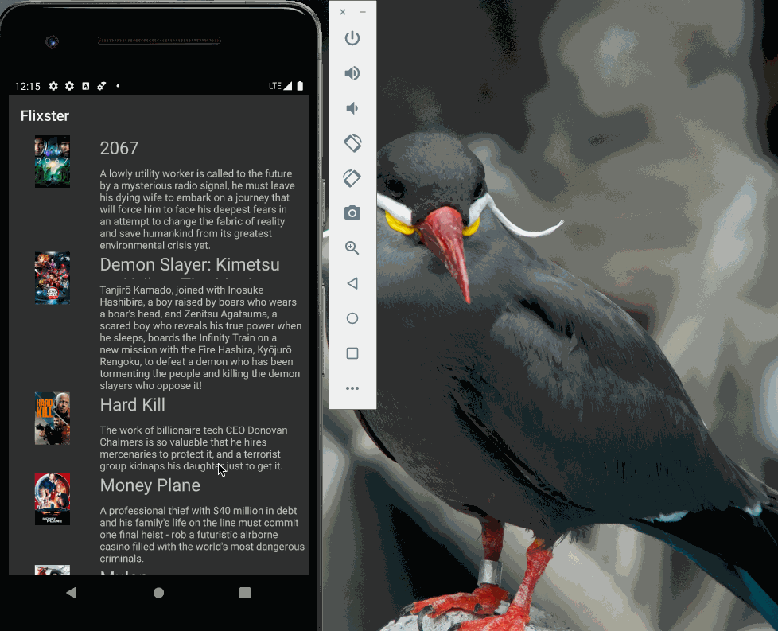

# Flixster App - Week1 Assignment for CodePath

**Flixter** is an android app that shows to the users all the english movies playing in the theatres now

Submitted by: Aishwarya Pothula

Time spent: 15 hours spent in total

##User Stories
The following **required** functionality is completed:

* [ ] User can **view a list of movies** now playing in the threates. Data is brought using the MovieDB API
* [ ] User can perform **vertical scroll** enabled by using Recyler view

The following **additional** features are implemented

* [ ] The app adjust the view to both **potrait** and **landscape** modes
* [ ] The app has a **dark theme** now
* [ ] A **placeholder image** (android picture) is in place to be rendered before a movie poster loads

## Working Log
Here's my [ working log ]( https://docs.google.com/document/d/1xoBIiz3JlWGRPyfQ9M7uWgfHPHodwiYug36crah_AGg/edit#bookmark=id.pnfzuxpcuy6t ) while implementing the app 

## Video Walkthrough
Here's a walkthrough of implemented user stories

GIF created with Liceecap

## Notes
While creating new 'android resource directory', choosing the **Orientation** and clicking on **>>**, takes me to the option of UI mode (field below). So I had to clicked on the 'Ratio' (field above) inorder to choose an Orientation.
